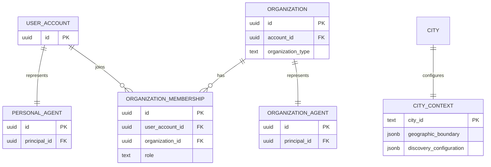

# Birdtie Agent Identity and Ownership Model

Date: 2026-09-30  
Status: **Accepted**  
Scope: Birdtie V2 identity, Agent authority, organizations, workspaces and city context.

This document is the canonical identity and ownership decision for Birdtie. It supersedes earlier proposals that treated City Agent as a third social identity or allowed organizations to act as ordinary human accounts.

## Product requirements and accepted decisions

Birdtie models authority as **Identity → Principal → Agent → Authority → Tools/Data**. Every Agent action is performed for an explicit principal and workspace. The server resolves the human actor from the authenticated session and checks membership, role, permission, visibility and consent; client context is never authoritative.

- A verified person account automatically has exactly one Personal Agent. Users cannot create multiple independent personal identities; future personas are modes of that Agent.
- Organizations are separate principals, never people. Societies, clubs, businesses, universities, communities, venues, nonprofits and other organizations share one model distinguished by `organizationType`.
- Real people administer an organization through membership. Initial roles are OWNER, ADMIN, MODERATOR and MEMBER.
- Each organization has exactly one Organization Agent representing the organization, independent of any administrator. Membership and ownership transfer do not replace the organization or its Agent.
- A person has a Personal Workspace and may access one or more Organization Workspaces. Personal is the default. Switching workspace changes the principal context, not the signed-in person.
- Personal and organization data and authority are isolated. Organization membership grants only explicit organization permissions; it never grants access to a member's private messages, Agent history, contacts, interests, location or activities. A Personal Agent cannot perform organization actions without an authorized organization workspace and server-side permission check.
- City is a platform-owned public context, not a social identity or ordinary Agent. Product language is **City Context**; implementation may use `CityContext` or `LocalContext`.
- CityContext has no user account, login, human owner or social profile. Birdtie Platform configures its geographic boundaries, public discovery, sources, ranking and safety rules. It indexes only public/authorized People, Activities, Groups, Organizations, Places and Events, respecting visibility and privacy.
- The shared Agent Runtime composes Personal Context or Organization Context with City Context and permitted tools according to the active workspace. City Context is not presented as a followable, friendable or chat-able city bot.
- Future Personal Agent ↔ Organization Agent interactions are allowed as capability requests, subject to authority, privacy, consent and visibility. They do not grant implicit cross-principal access.

## Ownership, permissions and workspace rules

```text
Person account ──1:1── Personal Agent
Person ──N:M via OrganizationMembership── Organization ──1:1── Organization Agent
City ──1:1 logical── CityContext (platform-managed; no account)
```

Every invocation carries server-derived `actorUserId`, `principalType`, `principalId`, `workspaceType`, membership `role` when applicable, and the checked permissions. The API rechecks authority on every read and write. Public city retrieval can contribute public results to either workspace, but it does not broaden access to private data. External side effects that require user confirmation remain proposals until confirmed by an authorized human.

## MVP lifecycle

Person signup creates one person account and its Personal Agent atomically. Organization creation is initiated by a signed-in person; it creates an Organization, membership OWNER for the creator, and one Organization Agent atomically. Owners can invite administrators, transfer ownership, change roles and remove members in later lifecycle slices without changing organization identity. Membership removal immediately revokes organization authority. The organization and its published objects survive administrator departure.

CityContext is created/configured by platform operations for a City and has no login lifecycle. Publishing a public object makes it eligible for city indexing only after the object's own confirmation, visibility and moderation rules pass.

## Recommended data model

- `User` (existing `accounts` with `account_type='person'`) and private profile.
- `Agent(id, type, principal_type, principal_id, status, created_at)`, unique on principal and type. MVP types: PERSONAL, ORGANIZATION, SYSTEM. No City Agent record.
- `Organization(id, account_id, organization_type, name, profile, status, created_at)`; `account_id` is an organization principal, not a User.
- `OrganizationMembership(id, organization_id, user_account_id, role, status, created_at, updated_at)` with one active membership per person/organization.
- `CityContext(city_id, geographic_boundary, metadata, discovery_configuration, status)` as platform configuration attached to City, without account ownership.
- Agent invocation/audit context records the actor, principal, workspace, action, permission decision and purpose; never accept these authority claims from request JSON.

## Entity relationships



## Non-goals and implementation boundary

This decision does not create City social accounts, organization login credentials, multiple Personal Agents, implicit admin access to personal data, or AI authority inferred from generated text. It does not open unrestricted Agent-to-Agent messaging. Existing human-owned community submissions are not silently converted into Organizations; future organization publishing must use explicit organization principal authorization.

The model and API are foundational MVP slices. Invitations, ownership transfer, full permission administration, organization content publishing, production city-boundary geometry and Agent-to-Agent transport remain follow-up work.

## Superseded wording

Earlier documents referred to City Agent as a peer bot, knowledge source or user-addressable agent, and described City/Organization workspaces without specifying principal ownership. Those descriptions are superseded here: city retrieval is CityContext capability used by the shared runtime; organizations are membership-managed principals with their own Organization Agent. See the linked IA and architecture documents for the synchronized product boundary.
